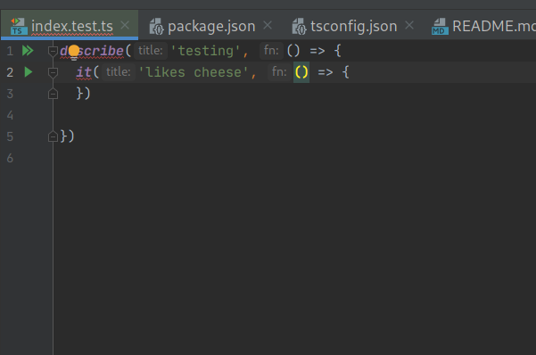

# Types hoist with file exclusion breaks typings

A combination of:

- Yarn workspace-based project
- Mocha globals in a test
- Yarn workspace nohoist on `@types/mocha`
- Exclusion of test files in tsconfig.json

Causes the symbols that should be added known by intellij to be unrecognised, as below:



This repo will reproduce the issue with a hoist directive and tests excluded. Run `yarn reinstall` between states to reproduce bug.

It seems to be `nohoist` and an exclusion pattern on the test that causes this issue, but I need both in my monorepo because 
`@types/jest` and `@types/mocha` used by different subpackages conflict (thus nohoist) and I don't want to include tests in my build output

## Cases

### Hoist without exclusion - works

In root [package.json](package.json)
```json
  "workspaces": {
    "packages": [
      "pkg/sub"
    ],
    "nohoist": [
      "**/@types/mocha"
    ]
  }
```
In sub-package [pkg/sub/tsconfig.json](pkg/sub/tsconfig.json):
```json
  "exclude": [
  ]
```

### Exclusion without hoist - works

In root [package.json](package.json)
```json
  "workspaces": {
    "packages": [
      "pkg/sub"
    ],
    "nohoist": [
    ]
  }
```
In sub-package [pkg/sub/tsconfig.json](pkg/sub/tsconfig.json):
```json
  "exclude": [
    "**/*.test.ts"
  ]
```

### Exclusion and hoist - breaks
In root [package.json](package.json)
```json
  "workspaces": {
    "packages": [
      "pkg/sub"
    ],
    "nohoist": [
      "**/@types/mocha"
    ]
  }
```
In sub-package [pkg/sub/tsconfig.json](pkg/sub/tsconfig.json):
```json
  "exclude": [
    "**/*.test.ts"
  ]
```
